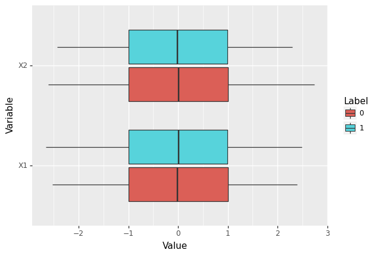
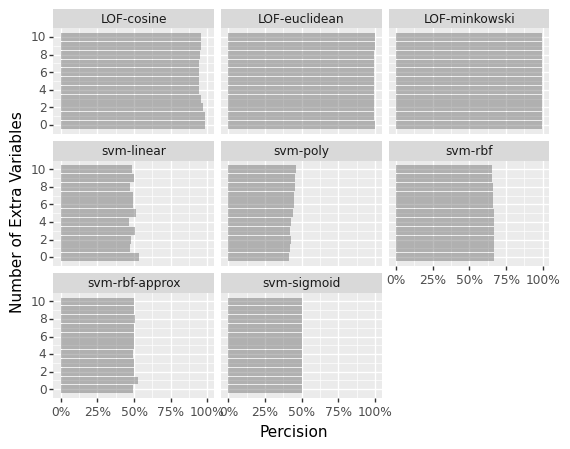

# Summary

Anomaly detection is a unique machine learning approach where a data
point is either considered typical or unusual (outlier). Potential
applications include identifying nefarious program behavior like
ransomware or identifying stolen debit cards. Interestingly, only
typical data is needed to train the model. This typical data defines a
distribution that the model learns. Once the distribution is learned, a
new data point can be labeled typical (meaning it is inside the boundary
of the training distribution) or an outlier (meaning it is outside the
boundary).

This repo compares eight anomaly detection models. Is one model better
than all the others?

Models:

- One class SVM with linear kernel
- One class SVM with polynomial kernel
- One class SVM with radial basis function kernel
- One class Approximate SVM
- One class SVM with sigmoid kernel
- Local Outlier Factor using minikowski distance
- Local Outlier Factor using euclidean distance
- Local Outlier Factor using cosine similarity

The main outcome of this simulation is Local Outlier Factor using cosine
similarity is the best model overall for these data. Horizontal scaling
is necessary for production. If this is not an option, the SVM model
with radial basis function as the kernel is the next best option.

# Data Overview

In this simulation, data comes from four two-dimensional Gaussian random
variables. The center of each random variable is at a corner of the unit
square. Data in the first and third quartile of the xy plane are
consider typical, and data from the second and fourth quartile are
consider outliers.

Looking at each variable separately, the distributions are identical
between both cases.

    <ggplot: (131023755445)>

It is only when both variables are considered together that an obvious
separation exists.

    <ggplot: (131023803516)>

To vary the challenge, zero to ten extra variables are added. By design,
these variables have no separation between the two cases. The idea is to
introduce similarity. When zero extra variables are added, each model
should be able to identify outliers. With 10 extra variables, outliers
are identical to typical data for ten out of twelve variables making
outliers harder to find.

Each setting of the simulation is repeated 10 times, and performance
metrics are averaged to reduce variability.

# Results

Measured by recall (proportion of outliers found), the SVM model with
the radial basis function kernel and Local Outlier Factor with cosine
similarity model have nearly identical performance. Interestingly, the
linear approximation SVM has very different performance then the real
SVM with rbf.

    <ggplot: (131025362149)>

Measured by precision (proportion of predicted outliers that are
actually outliers), Local Outlier Factor with euclidean or minikowski
distance are best. The cosine similarity model has nearly the same
precision.

    <ggplot: (131025881754)>

Taking both metrics together, the Local Outlier Factor with cosine
similarity model is best at least for these data.

# Only One Class

In the real word, anomaly detection models can be trained without a
single example of an outlier. This is a double-edged sword. Given 1,000
outliers, there could be 1,000 distinct definitions of why the data
points are outliers. Learning these 1,000 definitions using just one
example each is impossible. In addition, new definitions may present
themselves after model training. The ability to train a model without
providing a single example of an outlier is a major advantage.

Because there are no real examples of outliers, it is impossible to know
if the trained model is any good at identifying outliers. One possible
sanity check is to randomly shuffle a few variables from observed data
and use them as synthetic outliers. Can the model identify these data
points?

Even if performance is great for the synthetic data, it does not prove
real world outliers will be identified. There are two options. Either
accept this blind spot or find examples of real world outliers prior to
model deployment. There is no work-around for quality data.

# Scalability

Local outlier factor is variation of k-nearest neighbors. Therefore the
model essentially does nothing during the .fit call and only learns at
prediction time. Every call to .predict is associated with learning.
Prediction calculations are not going to be fast.

Luckily, computation is done on a per-row basis of prediction data. This
means it can be spread across CPU threads and even multiple CPUs.
Serverless horizontal scaling with the cloud is necessary for enterprise
scale.

For SVMs, prediction calculations do not require learning. Model
training can be done outside of production. However, model training
involves a single threaded algorithm with quadratic in sample size
complexity. Thus training time grows very quickly with respect to sample
size.

The SGDOneClassSVM model in scikit-learn approximates the SVM model with
the rbf kernel. This model has linear complexity instead of quadratic.
Unfortunately, the approximation did not work well for these data.
